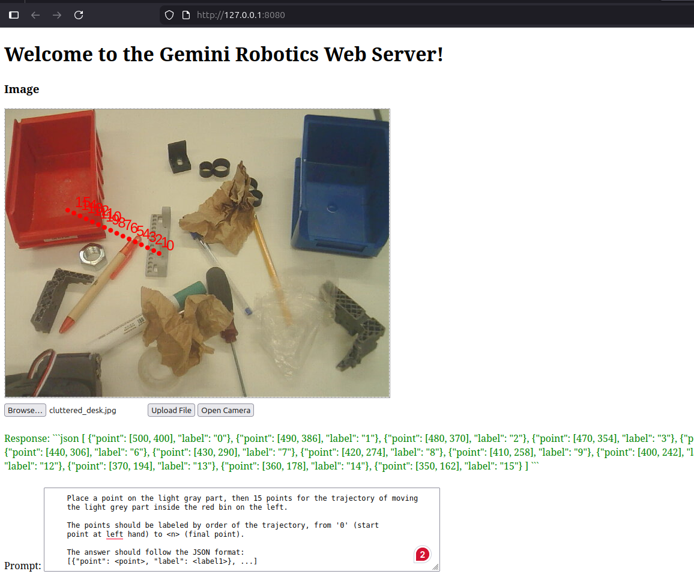

# gemini-robotics-er-demo-rs

A project to demonstrate the capabilities of Gemini Robotics-Embodied Reasoning (GR-ER) with a focus on Computer Vision tasks.

You need an `GEMINI_API_KEY` key that can be generated on the [Google AI Studio](https://aistudio.google.com) website and stored in `.env` file.

There is an option to use a local model instead of GR-ER API because it has a limit of 20 requests per day as of January 2026. Qwen3-vl:8b with Ollama is used as an example. Specify it in the `config.toml` file.

1. `cargo run` will start the web server.
2. Open `http://127.0.0.1:8080` in your browser.
3. Upload or capture an image.
4. Write a prompt.
5. Click "Send".

ToDo:
- [ ] Specify hostname and port for the web server in `config.toml`.
- [ ] Specify ollama hostname and port in `config.toml`.